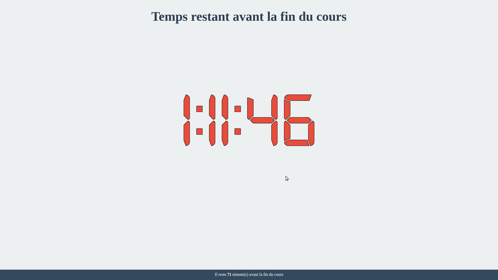

# Décompteur de temps Javascript

## Fonctionnalités
- Décompte de temps avant les pauses de cours
  - 10h45 _(pause matin)_
  - 12h30 _(pause déjeuner)_
  - 15h45 _(pause après-midi)_
  - 17h30 _(fin des cours)_
- Gestion heures, minutes, secondes restantes
- Style horloge

## Utilisation
1. Charger la page **index.html**
2. Mettre en plein écran _(Facultatif)_

## About
- TP Javascript (MASTER 1 - Développeur Full-Stack)
- Javascript + Framework JQuery
- HTML, CSS
- © **Dimitri Sandron** - _Février 2017_

#### Améliorations possibles
- Paramétrage des dates limites pour le décompte
